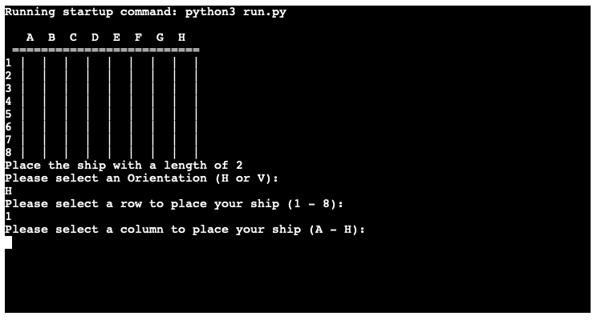

# Battleships - The Ultimate Timekiller

This Project is a Submission for PP3 with Code Institute Diploma in Full Stack Development. This Project is based on Project Idea 2 from the Assessment Handbook, which is to create an interactive BattleShip Game for Users.

[The Live Game Can Be Found Here!](https://jmc-pp3-battleships-8128d5944773.herokuapp.com/)

# How to Play

When the game loads in the browser users will be presented with their board. It will start off blank and they will be prompted to begin assigning locations for their fleet.

Once Players select an orientation for their ship, Horizontal or Vertical, denoted by "H" or "V" in Game for ease of use, they will then be prompted to select a Row.

Visible along the left-hand side of the board, there are 8 rows for players to choose from. The Game will prompt players to select a valid input if they input incorrectly.

Once a Row is selected, players will then need to choose a column to complete the coordinate for the head of their ship. These are displayed along the top of the board and can be selected by entering the relevant letter value in either Upper or Lower Case.

Once a position has been selected the ship will be deployed to the board, with its first box being the specified location, with the rest of the length filled to the Left or Straight Down, based on the selection of Horizontal or Vertical respectively.

Placed ships, and correct guesses by either party, are denoted by "X" on the displayed boards.

The winner is the player who sinks their opponent's fleet first.

# Features

## Current Features;

* Player Controlled Input 
    * Players can choose where their ships are placed on their board
    * Players can place their ships with specific orientations

* Computer Controlled Input
    * The Computer Opponent is able to place ships in much the same way as the player, increasing the base difficulty of the game
    * The Computer takes turns alongside the player, with short response times to allow for faster gameplay

* Live Boards
    * As the boards are rendered fresh for each turn, players can look back to keep track of previous moves and plan their strategy accordingly

* Robust User Input
    * The program automatically converts all inputs into a version it can parse
    * Changing the case of text inputs to all be the same helps cut down on the length of code, preventing any delays in response during gameplay
    * In the case that a user inputs an incorrect input or one that does not match what the system is seeking, Try/ Except checks can prompt users to try their inputs again

* Well Documented CodeBase
    * The source code for this project has been well annotated to ensure that any changes can be made efficiently, as well as allowing users to make changes to the game should they wish to create a modded version

* Planned Future Features
    * Future versions of this game are planned to provide a range of further "Quality of Life" Improvements 
        * Allow for several Board Sizes & Variable Ship Numbers
        * System to provide the user with a set amount of hints to lower difficulty
        * Continual Score Tracking & Rematch System 

# Testing

* I have manually tested this game and play-tested it with some volunteers to ensure that it plays smoothly and is easily navigable. Some of the steps I have taken in my testing were;
    * The code was passed through the CI Python Linter and no errors have been found
    * Inputting purposely incorrect inputs to ensure that the error-handling system is robust
    * Completed several run-throughs of the game, both in the VS Code Terminal and on the Heroku Live build

## Bugs

### Solved Bugs

* An overlooked bug from initial testing where the computer's board was printed on starting the game was removed, to ensure that the user did not know their opponent's positioning before the game started
* A visual error where the board would appear condensed when deployed was resolved by editing the create_board() function to allow for greater spacing

### Remaining Bugs

* No bugs appear to remain in the project at present

### Validator Testing

* The game was passed through the CI Python Linter and no errors were found

# Deployment 

This project was deployed using Code Institute's mock terminal for Heroku.

* Steps for deployment;
    * Fork or clone this repo
    * Create a new Heroku app
    * Set the Buildbacks to Python and NodeJS in that order
    * Like the Heroku App to the repo
    * Click on Deploy 

# Credits

* Code Institute for the deployment terminal 
* Stack Overflow for error explanations and solutions
* WEB3 School for Documentation 